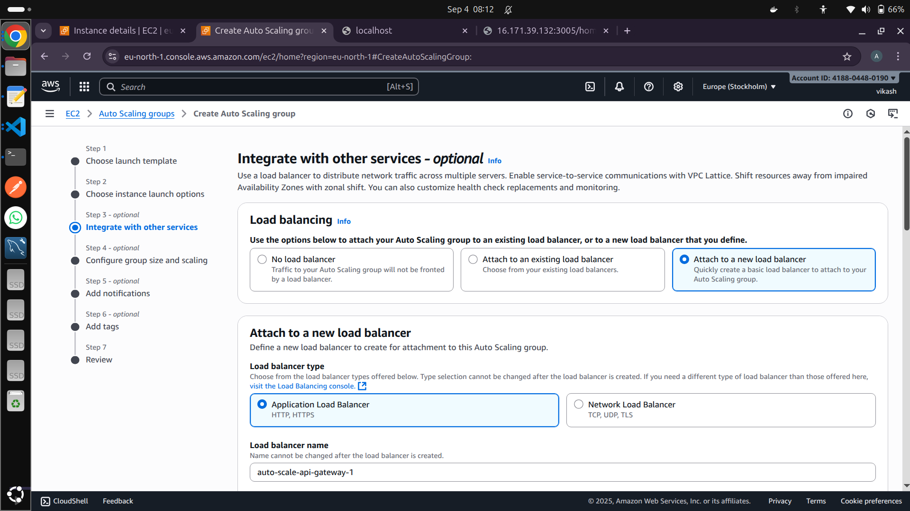
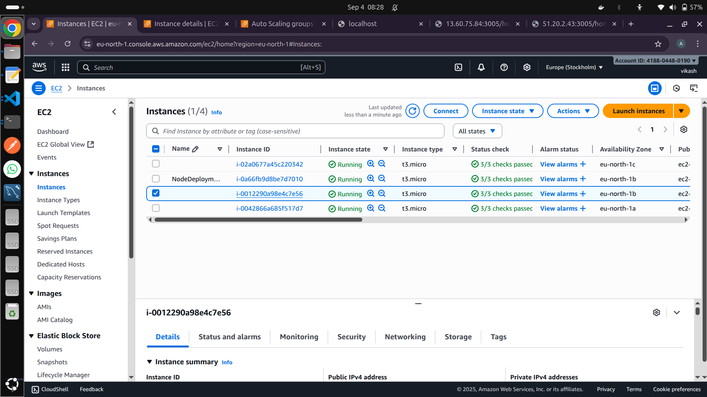
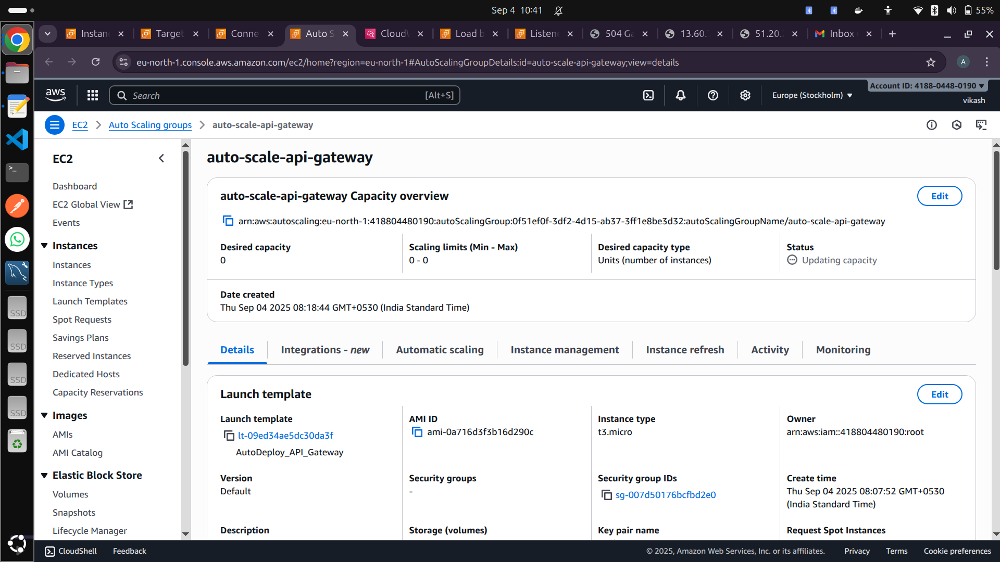
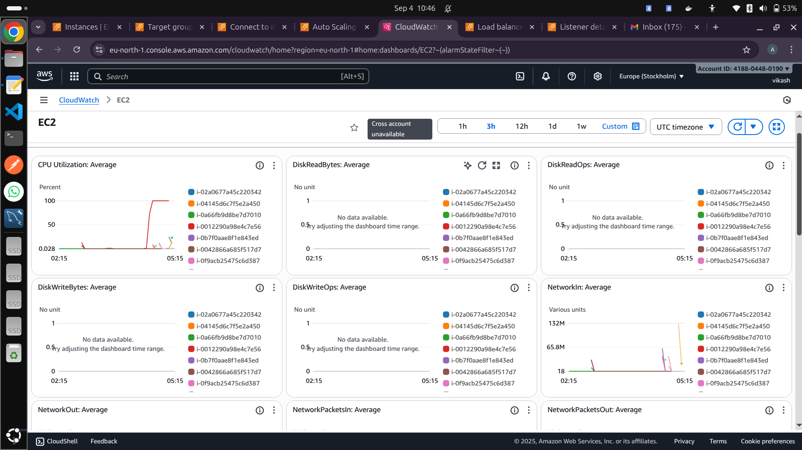

## API_GATEWAY Overview

FRONTEND - MIDDLE-END - BACKEND

- We need an intermediate layer between the client side and microservices
- Using this middle end,when client sends request we will be able to make decision that which microservice
- We can do message validation, response transformation, rate limiting
- We try to prepare an API Gateway that acts as this middle end.

# AirTicket_API_GATEWAY

This project implements an **API Gateway** for an airline flight booking backend, designed to act as a **middle layer** between the client-facing frontend and ** backend microservices **.

## Related Projects / Services

- [AirTicket API Gateway](https://github.com/VIKASH1596KUMARKHARWAR/AirTicket_API_GATEWAY)


- [AirTicket Auth Service](https://github.com/VIKASH1596KUMARKHARWAR/Auth_Service)

- [AirTicket Flight Service](https://github.com/VIKASH1596KUMARKHARWAR/FlightAndSearchService)

- [AirTicket Booking Service](https://github.com/VIKASH1596KUMARKHARWAR/AirTicket_BookingService)

- [AirTicket Remainder Service](https://github.com/VIKASH1596KUMARKHARWAR/AirTicket_RemainderService)

## Overview

- The API Gateway routes client requests to the appropriate **microservices**, including booking, flight information, and user management services.
- It enables **message validation**, **response transformation**, and **rate limiting** to ensure smooth and secure traffic handling.
- The system is deployed on **AWS**, leveraging **Auto Scaling Groups** and **Load Balancers** to handle varying traffic loads efficiently.
- Static assets (images, files) are served from the `assets` folder.

  
_loadBalancerSetup.png_

  
_initial-without-any_Load_on_CPU.png_

  
_auto-scaling-api-gateway.png_

  
_monitoring-instances-loadBalancerEffect.png_

  
_auto-scaling-once-terminated-the-other-instances.png_

## Architecture

```

Public FRONTEND → API Gateway (Middle-end) → Microservices (Booking, Flight, User, etc.)
↑
Rate limiting, validation, response transformation
↑
Auto Scaling + Load Balancer (AWS)

```

### Key Features

- **API Gateway**:

  - Routes requests to the correct microservice.
  - Performs rate limiting to prevent abuse.
  - Validates incoming messages and transforms responses.

- **Microservices Architecture**:

  - Each service handles a specific domain (Booking, Flights, Users).
  - Independently deployable and scalable.

- **AWS Deployment**:

  - **Auto Scaling Group** ensures the right number of EC2 instances are running based on load.
  - **Load Balancer** distributes traffic across instances.
  - Rate limiting configured at the API Gateway level.

- **Asset Management**:
  - Images and static assets are served from the `assets` folder.

## Learning & Deployment Highlights

- Configured **auto-scaling** and **load balancing** for backend services to handle traffic spikes.
- Implemented **rate limiting** and request validation to secure the API.
- Learned **AWS deployment best practices** for scalable microservices-based backends.
- Developed a fully functional API Gateway to act as a **middle-end layer** for the airline booking system.

## Usage

1.  Clone the repository:

        ```
         git clone git@github.com:VIKASH1596KUMARKHARWAR/AirTicket_API_GATEWAY.git
        cd AirTicket_API_GATEWAY

        ```

2.  Deploy microservices on AWS EC2 instances.
3.  Configure the API Gateway with routes for each microservice.
4.  Assets (images, static files) can be placed in the assets folder.
5.  Use load balancers and auto-scaling groups to ensure high availability and scalability
